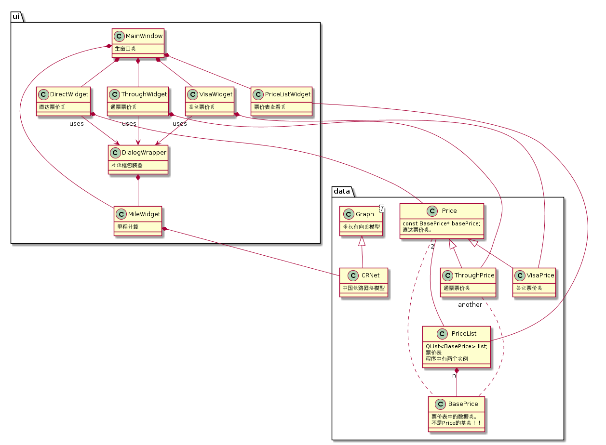
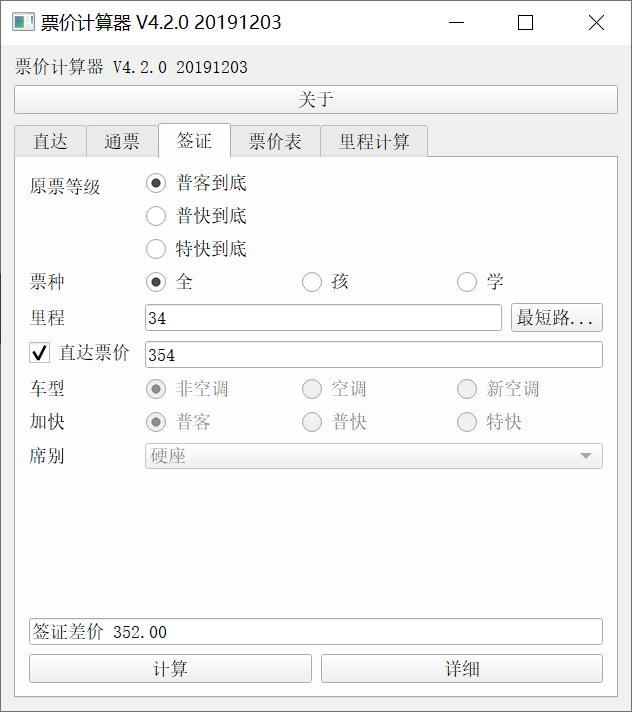
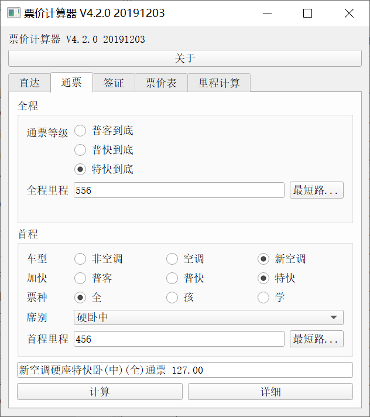
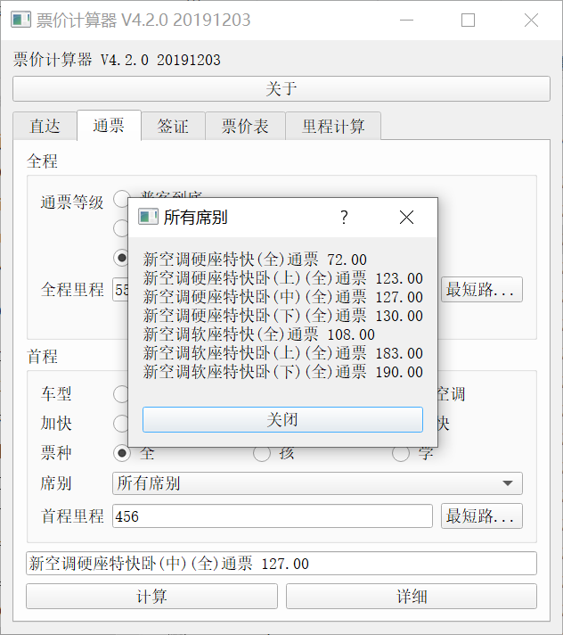
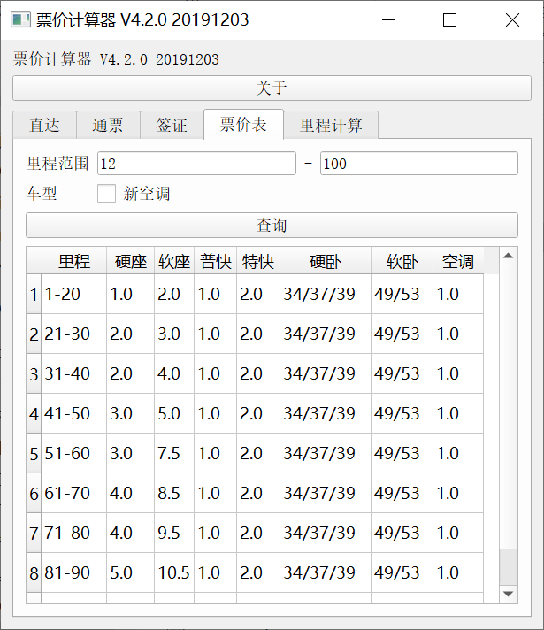
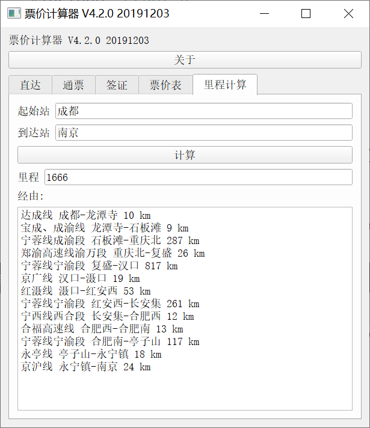

## 《高级程序设计》课程设计三报告

# 中国铁路票价计算器

- 选题：中国铁路票价计算器（开放选题）
- 姓名：马兴越
- 学号：171870660
- 院系：现代工程与应用科学学院
- 编写调试平台：Windows 10, Qt Creator 4.6.2
- Qt 5.11.1 for Desktop, MinGW 32bit，或者部署到Android平台上运行。

不使用Qt Designer设计界面，所有界面布局用纯C++代码完成。

## 提交目录

- `project` 目录，包含完整的Qt Creator工程文件。
- `bin`目录，用构建套件构建的可执行文件，并经过`windeployqt`部署操作，理论上可以直接运行。

## 背景简介

本应用主要针对中国铁路普速旅客列车票价计算问题及里程计算问题。我们论域内的国铁普速旅客列车票价，是**与具体车次和线路无关的**，但由较为复杂的成分构成，其中有些部分不大直观甚至反直觉。因此有必要先明确范围，说明背景。

### 适用范围与名词解释

本应用适用于解决不包含折扣和票价上浮，且按照国铁票价规则、里程通算的国铁**普速旅客列车**票价计算问题，包括直达票、通票和签证，各种车型和席别（除高级软卧等执行市场化浮动价的高级席别外）。

> 说人话：不能算动车组列车，不能算有票价上浮、里程不通算的地方铁路（例如达成线、广深线）票价。

以下我们默认仅在论域内讨论，而不再强调。对于一些可能涉及到的名词，我们先做一些具体的明确：

* **票种、分票种票价**：是指票价的**独立**组成部分，即客票、加快票、空调票、卧铺票。

* **联合票、联合票价**：是指按照一定规则，将分票种票价加和形成的总票价。一般情况下，我们在窗口、12306网站购买的车票上显示的票价，都是联合票价。

  > 注意：一般情况下，分票种票价不能独立出现在票面上，即使是“卧铺票”这个具有迷惑性的名字，它也只是“卧铺联合票”的一个组成部分而已。

* **票价表**：指《铁路运价规则》附件《铁路旅客票价表》。我们利用票价表给出的各种**票种**在不同里程范围内的票价，根据用户指定的车型、席别等，进行叠加，计算**联合票价**。
* **里程**：指《铁路运价规则》附件《铁路客运运价里程表》（以下简称：客里表）所规定的里程。对于实际的车次而言，此处所指的**运价里程**不一定等于列车实际的运行里程。

### 普速列车的车型

对于本应用来说，普速列车的**车型**有意义的是关于是否有**空调**的问题。按照这个标准，全路普速旅客列车可以分为三类，即

* **非空调列车**。或者所谓的绿皮车，是指没有空调的列车。计算票价时，不计算空调票。
* **空调列车**。是指在非空调列车基础上，加装空调后的列车。计算票价时，在非空调列车的票价上，加上空调票。目前全路范围内的“空调列车”非常少（如果还有）。
* **新空调列车**。这是目前普速列车的最常见情况。是指出厂就带有空调的列车。计算票价时，**使用和非空调、空调列车不一样的体系**，并计算空调票。

需注意**新空调列车**与**空调列车**的票价计算的区别是非常大的。在票价表中，是使用两张独立的表来计算的。从由来上说，前者是后者上浮大约50%得到的，但我们并不关心这一点。

### 票价的构成

联合票价一般由以下四个部分构成。前面已经说明，新空调列车和另外两种列车采用不同的票价表体系，所以下列的票种，都有两套不同的数据，但组成结构是相同的。

* **客票**。分为硬座客票和软座客票两种，是票价最基础的部分。任何联合票，**一定包含客票部分**。

* **加快票**。按照列车加快等级的不同，有三种情况：

  * **普客**。没有加快票，具体包括所有的普客车次（车次在6001-8998的列车）。
  * **普快**。收取普快加快票，具体包括所有的普快车次（车次在1001-5998的列车）。
  * **特快**。收取普快加快票的两倍，不属于前两类的，都属于这类。

  > 需要说明：K, T, Z字头的列车加快票是一样的。不存在“快速加快票”这样的说法。

* **空调票**。在上一节中已经说明过。只有非空调列车不收取空调票，其他两种都要算空调票。

* **卧铺票**。在普速票价体系中，**卧铺票是在客票基础上叠加的部分**。分为硬卧卧铺票和软卧卧铺票两种，又分别分为上中下铺、上下铺两种，票价各有不同。

  > 这一点比较反直觉。在底层的设计中，卧铺并非是和坐席独立的两种席别，而是卧铺票是在座票上的叠加。究其原因是历史遗留问题。事实上，现有的无座票和硬座票票价相同也是这种历史遗留的体现。

### 优惠票

本应用支持三种票种，即全票、学生票、儿童票。全票即按照基本规则算出来的票价，无需赘述；学生票和儿童票的区别仅在于学生票不发售软席（包括：软卧、软座）。我们以**优惠票**统称两者，并简要说明计算规则如下。

> 按：学生票和儿童票其实还有一点区别，在于对于动车组二等座，学生票是（在公布票价基础上）取七五折，而儿童票是五折。但由于动车组票价计算超出了我们的讨论范围，此处不讲。

按照《铁路旅客运输规程》，我们可以给出优惠票的定义：

> **定义** 优惠票是指在联合票价全价的基础上，**客票、加快票、空调票**折半的票价。

在通常的使用中，在忽略舍入问题的前提下，下面这条定理是实用的：

> **定理** （优惠票的计算）
>
> * 坐席优惠票等于原价的一半。
> * 卧铺联合票的优惠票，等于卧铺联合票的原价，减去相应的坐席票原价的一半。

这个定理的实质，就是四种基本票价中，只有卧铺票没有折半。定理的证明是平凡的，不再赘述。

在本应用中，优惠票种以略语的形式写出。

```
(全) (孩) (学)
```

### 票种说明略语、示例

在本应用中，我们以如下规定格式的略语在计算结果中表明计算所用的车型、票种、席别。需说明，我们这里的略语与现行火车票面上的略语不同，而比之更加详细和靠近底层，更接近于老版本火车票面的略语。

```
{空调类型}{客票类型}{加快等级}{卧铺}({票种})
```

其中空调类型可以是 (空白)、空调、新空调三种，客票类型可以是硬座、软座两种，加快等级可以是(空)、普快、特快三种，卧铺可以是(空白)、卧两种，票种是全、孩、学三种之一。

我们举几个实际的例子来说明票种略语。

* Z85次列车的硬座联合票略语为：`新空调硬座特快`。
* 2671次列车的硬卧联合票略语为：`新空调硬座普快卧`。这样的略语，体现了前述的卧铺票是叠加在客票上的原理。
* 6063次列车硬座联合票略语为：`硬座`。它只有硬座客票，没有其他票种。
* K503次列车软卧联合票略语为：`新空调软座特快卧`。

### 通票及签证简介

按照《铁路旅客运输规程》的规定，车票可以大致分为两种，即**直达票**和**通票**。直达票即日常买到的票，从发站至到站之间，只有一张票、一个票价（联合票价）。

从定义上说，**通票**是指发站到终到站之间需要换乘的票。从操作上说，可以分为两步：

* 旅客购买通票，通票包括始发站、中转站、终到站。通票需指定始发站至中转站的车次、席别（和直达票一样），同时指定中转站至终到站之间的径路（隐含里程）。简单地说，通票票价由两部分组成：

  * 始发站至中转站间的直达票价。
  * 中转站至终到站之间的**非空调**客票和一部分的**非空调**加快票。

  需强调，这只是为方便理解而这样说的，实际计算并非如此，会带来一点差异。根据前面的加快票的不同，通票可以分为三种，

  * 普客到底通票。中转站至终到站之间，只付了客票，没有付加快票。
  * 普快到底通票。中转站至终到站之间，付了客票和普快加快票。
  * 特快到底通票。中转站至终到站之间，付了客票和特快加快票（普客加快票的两倍）。

  通票的票面如下图所示。

  

* 旅客乘坐通票指定的列车，到中转站凭通票办理**中转签证**。中转签证应指定本站至下一中转站（或终到站）之间的车次、席别。中转签证票价可以理解为所选车次、席别票价与这一段内，通票中已经给付了的客票和加快票的**差价**。

  需说明两点。一是实际计算也并非是直接作差的，而是根据席别的差异，分席别计算再叠加的，这是有差别的。二是**零元签证**是可以实现的，如下图所示。

  

这里仅仅对通票和签证的票价计算做了简单的说明。实际的计算远比这个复杂，在应用中采用的是实际的计算方式，经检验其结果是比较准确的。但考虑到篇幅问题，这里没办法详细的展开。

## 架构设计

现在终于可以说和代码相关的问题了。为了说清楚计算的逻辑，这里先简单说一下整个应用的模块设置和逻辑流程。

### 概要

本应用一共有五个基本模块，分别为

1. 直达票票价计算
2. 通票票价计算
3. 签证票价计算
4. 原始票价表查询
5. 站间近径路里程计算

其中，前三个模块的计算逻辑是相似的：

1. 读取票价表数据。票价表包含的是各个里程区间的分票种票价数据。这部分数据保存在`PriceList`类中，程序中它有两个实例。单个的票价数据保存在`BasePrice`类中。
2. 用户选择车型、票种、席别、优惠票。
3. 程序根据用户的选择做计算并输出。计算票价的类是`Price`（直达票价），`ThroughPrice`（通票票价），`VisaPrice`（签证票价）。

### 类结构

所有的类可以抽象地分为两大块，即**数据域**和**窗口域**。前者包含票价表数据，铁路网络模型及计算逻辑，基本基本上不用Qt的东西（事实上，要除了少数的`QList`和`QString`）；后者包含窗口类，主要用`QLayout`、通过纯C++代码进行界面设计和管理。基本实现了逻辑和界面的分离。

由于本应用涉及到的类不算多，这里的分类仅仅是抽象的，并没有通过文件夹的划分来实现。国际惯例，先上（不大规范的）UML类图表示类之间的大概关系，我们用约定`ui`前缀表示上述的窗口域，`data`前缀表示上述的数据域。



这张类图的粒度精确到窗口级别，忽略了控件和`QtWidgets`中的基类。图中我们约定实线表示静态的关联（两个类的实例在整个生命周期中都是互相绑定的，但并非是值类型的包含）

### 数据部分

#### 基础票价类`BasePrice`

基础数据类在逻辑上相当于票价表中的一行。虽然名字具有一定的迷惑性，但是需要强调，**`BasePrice`类无论在逻辑上还是实现上，都不是`Price`类的基类**。其数据成员主要有适合的里程区间和各种分票种票价两部分；支持的操作主要是根据类型返回相应的分票种票价。（例如，给定指出“席别”的参数，返回相应的硬座或者软座客票）

```C++
class BasePrice
{
    int minMile,maxMile; //上下界。均包含
    double hSeat,sSeat; //客票票价
    //其他各种票价...
public:
    //有一定封装的，根据类型返回分票种票价的三个函数：
    double seatPrice(SeatType type)const;//客票票价
    double sleeperPrice(SeatType type)const;//卧铺票价，非卧铺返回0
    double speedPrice(FastType type)const;//加快票价
};
```

所有的与“类型”有关的有限枚举数据，

> 例如：非空调/空调/新空调，普客/普快/特快等

都是用枚举类型实现。这些枚举类型大多数定义在baseprice.h中，但与通票有关的定义在throughprice.h中。这里仅列出对席别的定义。这里的席别定义与界面中的选择项相接轨，已经是普遍为大众所接受的席别表示形式，组合了底层的客票、卧铺票两个部分。其他的枚举类型定义更为简单，不必列出。

```C++
enum SeatType{
    HardSeat=0,HardSleeperL,HardSleeperM,HardSleeperU,
    SoftSeat=10,SoftSleeperL,SoftSleeperU
};//席别。>=10表示软席，允许直接用这个来快速判定。
```

#### 票价表类`PriceList`

票价表是基础票价的集合，核心部分采用`QList`实现。类定义是平凡的，其中比较常用的方法是

```C++
int findMileIndex(int mile)const;
const BasePrice* findMile(int mile)const;
```

使用二分法查找票价结点，或其位置。

如前所述，程序中有两个`PriceList`的实例，分别指**非空调**票价表和**新空调**票价表。在所有的类中，这两个实例（或其指针）都用`oldList`和`newList`来命名。

#### 直达票价类`Price`

`Price` `ThroughPrice` `VisaPrice`三个类在逻辑上的意义是相当的：都表示<u>用户输入的各种参数所对应的一种情况下的票价及其内容</u>。或者说，可以理解为，打印在一张火车票票面上的票价，及其背后包含的内容。在实现上，保存了里程和一系列的枚举数据，保存有`oldList`和`newList`两个`PriceList`类型的指针。每次用户输入一个里程，就根据是否是新空调，决定在两张表之一中，查找`BasePrice`结点（即：将里程对应到票价表当中的一行），保存在`BasePrice*`指针中。

类定义的概要如下。主要有一个`setData`方法是输入性质的方法，其他的主要是输出。

所有的直达票价计算，都在这个类里面完成。程序的外部需要联合票价或者某个部分的票价时，都调用本类方法获取，而不再类外部做运算。

```C++
class Price
{
protected:
    int mile;//用户输入的里程
    const PriceList* oldList,*newList;//非空表和新空表。
    ACType acType; //各种枚举类数据
    const BasePrice* basePrice;  //查找到的票价表
public:
    void setData(int mile,ACType actype,SeatType seattype,FastType fasttype,
                 DiscountType discounttype);//用户选择了新的参数时调用
    double unionPrice()const;//返回联合票价
    QString typeString()const;//类型说明文字
    QString resultString()const;
    double seatPrice()const;//客票票价
protected:
    static double correctPrice(double price); //修正票价，主要指舍入调整
    QString acString()const;  //生成各个部分的字符串
};
```

通票票价`ThroughPrice`、签证票价`VisaPrice`是继承本类实现的。这不仅有实现上的作用，在逻辑上也是有道理的。通票票价和纯普速情况下的签证票价，从逻辑上说都包含了直达票的功能，并有扩展的逻辑。下面简要说明。

#### 通票票价类`ThroughPrice`

对于一张通票而言，有两个里程是有意义的，即全程里程和首程里程。因此在继承`Price`基类的基础上，还要增加一个里程信息，一个`BasePrice`的指针，这也是类图中“another”虚线的含义。由于通票的首程与直达票有更接近的性质，所以增加的数据，对应到全程里程和全程票价上。其他的差异都是平凡的，无非是增加了一些计算的函数，例如

```C++
    double throughSeatPrice()const; //通票全程客票。皆已经考虑优惠票。
    double throughFastPrice()const; //通票全程加快票
    double seatAddPrice()const;  //首程客票差价
    double fastAddPrice()const;  //首程加快差价
```

#### 签证票价类`VisaPrice`

同样是`Price`的派生类，但签证票价相较于通票票价，更加简单，因其只涉及到一个里程、一套基本票价`BasePrice`数据。这里特别提出来，只是因为签证票价支持了两种计算方式：

1. 常规的计算方式。输入列车等级，席别等信息，根据内置逻辑计算。
2. 对动车组等非常规计价方式的简单支持。输入签证区段的直达票原价，计算差价。这里的逻辑是非常简单的，即输入的直达票原价减去所选择的通票等级（普客到底，普快到底，特快到底）中已经给付的票价。

显然上述第1种计算方式与直达票、签证的计算方式相同；而第二种属于额外的支持，为此给`setData`重载了一个函数以支持这样的方式。

```C++
    void setData(int mile,ThroughType throughtype,DiscountType discounttype,
                 double inputedprice);
```

#### 国铁线路网络模型`CRNet`

这部分直接复用了去年算法课时候写的带权有向图的邻接表实现模型，修改了一下基类，然后派生实现了铁路线网模型类`CRNet`。

> （当时的代码比较蠢，没怎么用STL之类的，顶点上的边集是用原生链表实现的，顶点表是用原生动态数组实现的

对本应用有意义的部分主要是使用Dijkstra算法实现的单源点最短路径算法。模版类参数`T`表示结点和边的数据类型。由于这个图模型不仅用于本应用，还有其他地方的使用，所以有些函数的实现（例如Topology排序相关的）对本应用实际上是没什么关系的。

这里列出的声明是与最短路径计算有关的函数。由于实现的Dijkstra算法中记录各个顶点距离采用的是临时动态数组，在`sssp`函数中创建和销毁，所以用**模版方法**设计模式对结果做处理。在路径数组`pi`和距离数组`length`消亡前，调用`processSsspResult()`方法处理结果。

> (被五个s支配的恐惧

`Graph<T>`基类只提供了空白实现，什么都没做。

```C++
public:
	void sssp(const T& source);//single-source-shortest-path
protected:
    virtual void processSsspResult(int s,int pi[],double length[]);
```

国铁网络模型`CRNet`是`Graph<QString>`的派生类。其顶点数据内容为车站站名，边上的数据内容为该边对应的铁路线名。

部分方法声明为

```C++
	int mileBetween(const QString& from,const QString& to,QStringList& path);
    void read();
    virtual void processSsspResult(int s,int pi[],double mile[])override;
```

其中`mileBetween`调用`sssp`计算所给源点到所有其他点的最短路，并只取出所需要的区间。`read`方法读取指定的资源文件，进行初始化。这样看起来割鸡用牛刀，不过测试了一下，在我们输入的4454顶点的国铁网络模型中，并没有发现卡顿。

`processSsspResult()`方法按照`pi[]`数组记载的路径进行回溯。`pi[]`记录的是有向路径中每个结点的前驱结点编号。由于铁路线网图的特殊性，某个区间可能存在多条线路，并且其里程并不一定相同。很显然，sssp算法走的时候最近的那条边。所以我们用

```C++
Edge<T>* Graph<T>::shortestEdge(int from, int to);
```

方法来找最短的边。特别的，当区间有多条线路并且里程相同时，我们将其等同对待。我们按照铁路经由描述的习惯处理结果，最后的输出形式为

```
京沪线 南京-镇江 64 km
沪宁高速线 镇江-丹阳 27 km
京沪线 丹阳-苏州 125 km
沪宁高速线 苏州-安亭北 55 km
虹安线 安亭北-上海虹桥 29 km
```

当然，从实用角度说，这样的最短路可能是无法实现的，或者说无法直达实现。例如本例中京沪线、沪宁高速线在镇江、丹阳、苏州是不接轨的，实现这样路径的不可能是一趟列车，而只可能是旅客反复换乘。所以这个结果也仅能作参考。

实际的铁路行程规划问题还是相当复杂的，远远不是一个sssp算法就能解决的问题，我们这里只给出里程意义下的最短路。

`CRNet`类采用**单例类**设计模式。这样做是因为，逻辑上`CRNet`类应将值类型放在里程计算页面`MileWidget`类中，但整个程序中`MileWidget`不止一个实例（由于对话框的使用），而每次实例化都创建一个`CRNet`实例显然是不合适的。

### 窗口部分

窗口部分的基本原则是每个窗口一个类。虽然三种票价计算的窗口还是有些类似性的，但是其逻辑还是有很大不同，例如同是计算，点击后要执行的操作，依赖的控件数据都不同；最大的区别是“通票票价”部分需要两个里程输入窗口，而另两个只需要一个。考虑到这些，这三个类是完全独立的，无法回避较多的重复代码。

界面的实现没有太多需要说的。只需要说明一下，框架结构和类之间的关系。

#### 层次结构

整个应用窗口是一个`QMainWindow`的子类，其中主要内容是一个`QTabWidget`，五个模块以`QWidget`子类的形式，分别是其中的一个`Tab`。其中，`MileWidget`有复用，后面详述。

#### 与数据类的关系

`PriceList`类的两个实例`oldList`, `newList`，以值类型组合于`MainWindow`类中，而其他数据类保留的都是其指针。程序初始化时，读取文件，初始化这两个表。

直达票价计算界面`DirectWidget`包含直达票价类`Price`的值类型实例。事实上整个程序运行过程中，`Price`类也只有这一个实例。通票、签证界面类似，不赘。

#### 快捷类

根据程序中经常使用三个`RadioButton`一组的实际情况，又考虑到`RadioButton`的创建是比较麻烦的（需要加到布局，还要加到`QRadioGroup`中），所以将“三单选框”抽象成一个类`TriRadios`，在程序中直接调用。`TriRadiosV`则是纵向排布的三单选框。

程序中复用了`MileWidge`这个类，一共有五处使用，基本模块中的里程计算是一处，三个票价计算页面中，共有四个需要输入里程的地方，每个需要输入里程的地方都可以用`最短路...`按钮弹出计算里程的对话框，输入发到站，点击“计算”后，将里程框的数据变为算出来的结果。

为了方便弹出，写了一个`DialogWrapper`类，将`MileWidget`（事实上，任何其他的`QWidget`都行）和一个“关闭”按钮包装成一个对话框来弹出。这也是前面所说的`MileWidget`会有多个实例、多次实例化过程的原因。

### 支持数据

本应用共有三个数据文件，皆为文本文件，用qrc管理，`QFile`读取，放在`rsc`目录下。分别为：

* 非空调列车票价表`oldList.txt`，即前述的计算非空调车、空调车的票价表。
* 新空调列车票价表`newList.txt`，即前述的计算新空调列车的票价表。
* 邻接形式的客里表`adj.txt`。包含某一版本客里表的全部数据，通过预先做的Python脚本转换成邻接形式的数据。

两张票价表的数据结构是一致的。都是每一行对应一个里程区间的票价数据，在程序中被抽象成一个`BasePrice`对象。示例数据：

```
121 130 12.5 23.5 2 46 51 54 69 75 3
```

其中数据分别表示：里程下限，里程上限，硬座客票，软座客票，普快加快票，硬卧上、中、下，软卧上、下，空调票。

邻接形式客里表以每一行表示一条无向边（事实上，程序中通过两条反向的有向边来实现），其数据结构示例为

```
京沪线 林场 南京 15
```

数据分别表示：线路名称，区间起点，区间终点，区间里程。

## 界面概览、操作概要

程序启动后看到`QTabWidget`中的五个选项卡。

### 票价计算界面

前三个的布置是类似的，这里列出通票部分和签证部分。在签证部分，有一个`QCheckBox`控件用于选择是按照已知的直达票价计算，还是按照车型、加快、席别计算。如果勾选则输入直达票价，否则选择下面的内容。





在界面上选择需要计算的参数和里程，点击“计算”即可算出。结果显示在最下面，以票价略语+票价的形式。当点击“最短路”按钮时，弹出里程计算的对话框。

在计算通票票价时，如果有一些不正常的参数组合，则会出现警告信息。

前面已经提到过，应用中的席别选项采用的是封装过的，面向一般旅客的形式。所有的选项是

```
硬座
硬卧上
硬卧中
硬卧下
软座
软卧上
软卧下
计算所有席别
```

当用户选择了“计算所有席别”时，点击“计算”后将弹出对话框，显示所有席别的票价，如图所示：



当用户点击“详细”时，将自动计算票价，并弹出所计算票价的分票种构成情况，如图所示。


> 说明：“计算所有席别”模式下，不支持详细票价显示。如果这样操作，将弹出警告。

### 票价表查询部分

票价表查询部分提供便携的原始票价表查看功能。这里列出的是原始的分票种票价表，与程序读取的票价表一致，除了计算出了特快加快票外。输入要查看的里程区间，选择是否是新空调，即得。



### 里程计算部分

输入起始站和到达站，点击计算，系统即自动算出发站至到站间的最短路径及其里程。在经由一栏，是按照铁路习惯整理出来的经由。我们已经在`CRNet`部分详细说明过，此处不赘述。

当在其他票价计算模块点击“最短路...”按钮时，弹出的界面与此相同（除了多一个“关闭”）按钮。界面如图：



## 问题、解决、其他

> 其实不太明白为什么要求里这部分要重点……感觉没什么好写的

一些问题的解决前面也大概提过了，这里算是个汇总性质的。整个应用是立足实用角度写的，没有太多的难点，这里列出一些实际编码的经历和修改历程。

### Dijkstra算法的一个问题

由于前期写的Dijkstra算法有个小问题，即没有考虑到不连通图的问题。前期测试所用的旧版客里表模型也确实是连通的，但后面改用新客里表时，图中出现多个连通分支时，剩余的所有结点距离源点的里程都是无穷大（`INF`），导致返回结点编号`-1`，后续访问出错。

将取最近结点时候的`<`比较改成`<=`即可。

### 最短路径数据的表示

前面提到，单源点最短路径的实现`Graph<T>::sssp()`中，各个结点的回溯路径和距离源点的里程都是采用局部动态数组实现的。但将一个需要手工`delete`的指针返回给调用者处理似乎是个不大合适的做法；单源点最短路是图模型中经常需要用到的算法，但不同的图模型对结果的具体处理是不一样的，这就构成了矛盾（既不应该把数组直接返回，也不能全部写在`Graph<T>`基类中，也不应该全部写在派生类中）。

采用的处理方法，如前所述，是用**模版方法**设计模式。在路径和里程计算完毕后，调用虚函数`ProcessSsspResult()`，基类提供空白实现，在子类中给出具体的定义。

> 被五个s支配的恐惧 -_- 这不怪我

### 对话框大小问题

这是一个非常具体的问题。由于本应用设计了在Android设备上运行（尽管默认的主题在Android上非常的丑），弹出对话框的大小是个问题。在Android设备和桌面设备上使用同一套的字面常量来限定大小显然是不合适的，而Qt的默认大小又比较制杖（尤其是`QTableWidget`总是缩成一坨），最后采取了一个比较蠢的方法

```C++
#ifndef ANDROID
    wrapper.show();
#else
    wrapper.showMaximized();
#endif
```

其中宏定义`ANDROID`在util.h头文件中，通过注释和取消注释的方式在桌面端和Android端之间调整。

### 不完善的地方

目前为止，应用还有一些地方处理的不太好，或者有限制，这里列一下：

* 计算仅限6000公里及以下。这是因为票价表只提供到了6000公里，再往上的区间则给了每100公里增加的票价，这带来了额外的逻辑和舍入误差的风险。因此暂时没有实现这一项。一般来说，6000公里的里程是完全足够了。

* 里程计算中的经由显示部分，由于前面已经提到过的，相同区间、不同线路、里程相同的情况，程序是等同对待的，对于实现以外的程序部分也就是说，相当于随机返回其中的某一条线。比如说如果查询南昌至九江的最短路经由，结果是

  ```
  京九线 南昌-乐化 22 km
  昌九城际线 乐化-共青城 50 km
  京九线 共青城-德安 8 km
  昌九城际线 德安-九江 55 km
  ```

  但事实上，京九线和昌九城际线在这一段是基本上共线的，全程走京九或者全程走昌九的里程是一样的。

  当然，对于更一般的情况，甚至可能出现，完全不一样的两条径路，其里程刚好相同，这样的逻辑就更加复杂。本应用不考虑这样的情况。


